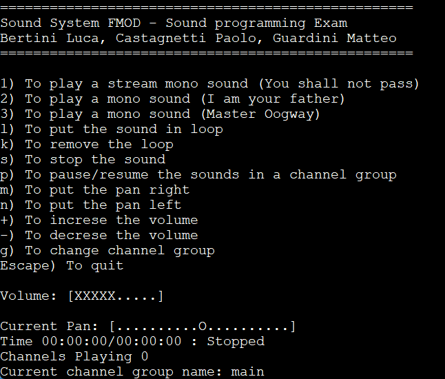

# SoundSystemFMOD
Project created for the Sound Programming course at the master in Computer Game Development at UNIVR.  

## Description
The code initializes a sound system and allows users to perform several operations, including playing sounds, adjusting volume and panning, pausing, stopping, and changing channel groups.  
The program continuously checks for user input and updates the sound system accordingly.  
It also includes error-handling functions and displays relevant information about the current audio state, such as volume, pan, playback status, and channel groups.  
In summary, it provides a straightforward interface for controlling and modifying audio playback.  

## First step
When you donwload the project you can find the exe in the x64/Debug/ folder. Our library is StaticSoundLib, it provides all the function to manipulate the 3 sounds in the main project.  
In the media folder you can find the 3 media used.  
In the FMOD folder there are the imports for the FMOD library.  

## How to play 
If you have executed the SoundSystemFMOD.exe or played from Visual Studio, the program will show you a cmd with several options:  
1,2,3) To play the selected sound.  
l/k) to put the selected channel on/off loop.  
s) to stop the sound.  
p) to pause/resume the selected channel playing.  
m/n) to make the pan shifting right/left of the selected channel.  
+/-) to increase/reduce the volume of the selected channel.  
g) to change the selected channel.  
Below all this option you can find a bar with the volume representation, the pan, the channel playing and the time informations.  

## Program screenshot

